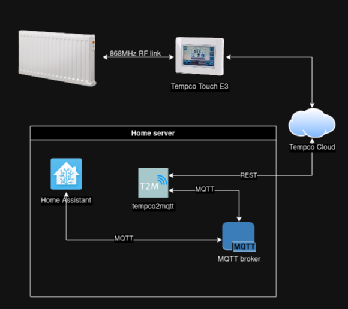

# Tempco Touch E3 to MQTT


Control and query Tempco Touch E3 using MQTT.
<div>
    
</div>
<br />


## Running the SW


Development mode

First, install dependencies
```bash
npm i
```

Edit the configuration file of the tempco2mqtt by adding host and credentials for the MQTT broker and adding credentials for the Tempco API.
Configuration file can be found under project root (./configuration.yaml).

NOTE: if you are using development environment, please create local .env file by copying the original template
```bash
cp configuration.yaml configuration.yaml.local
```
and change credentials to match yours.

Then run project using real connection to the Tempco servers
```bash
npm run dev
```

To run project using mocked Tempco API (one heater defined in fake_devices.ts), run
```bash
npm run dev:mock
```

Deployment mode

```bash
npm run run
```

## Architecture

<br />
<div>
    
</div>
<br />